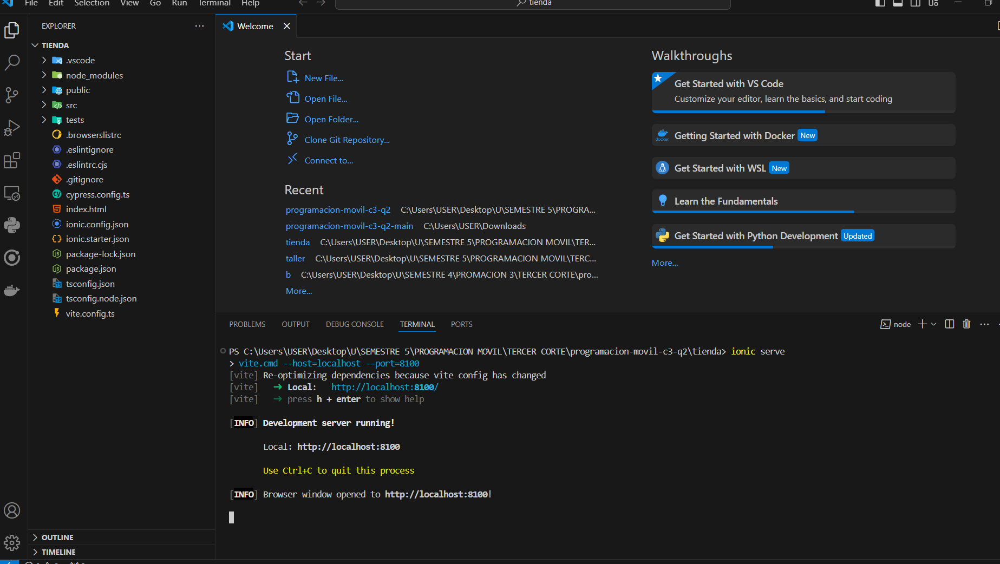
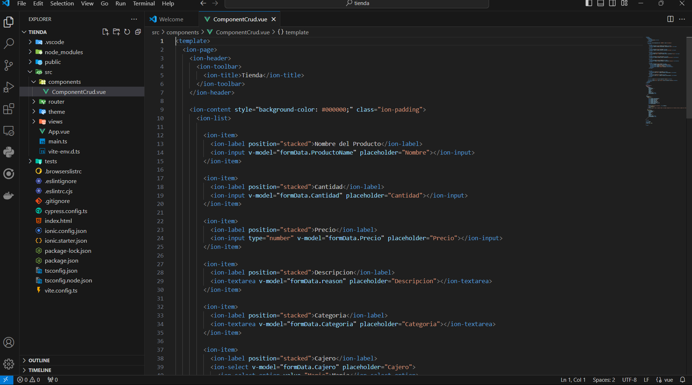
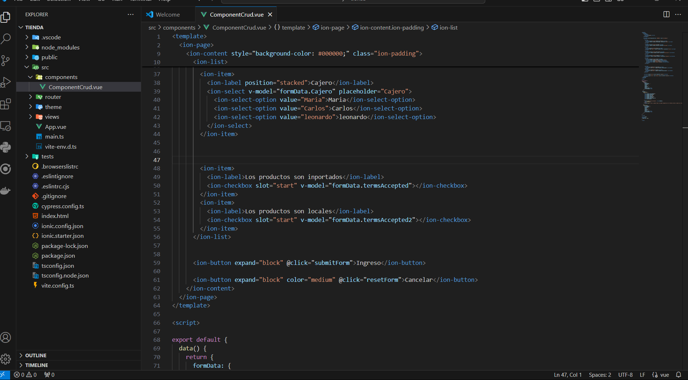
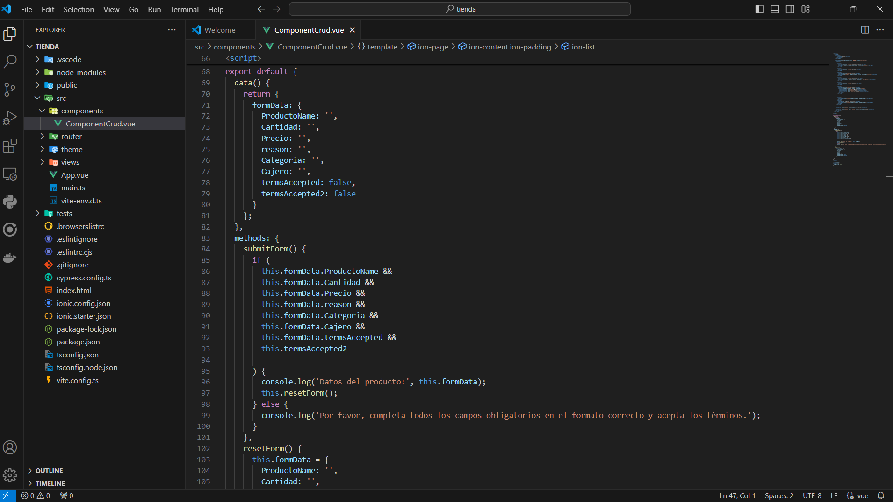
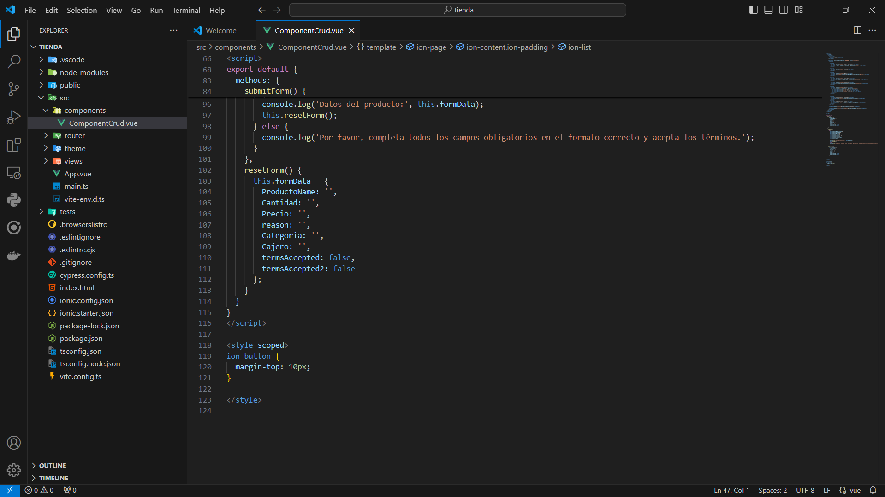
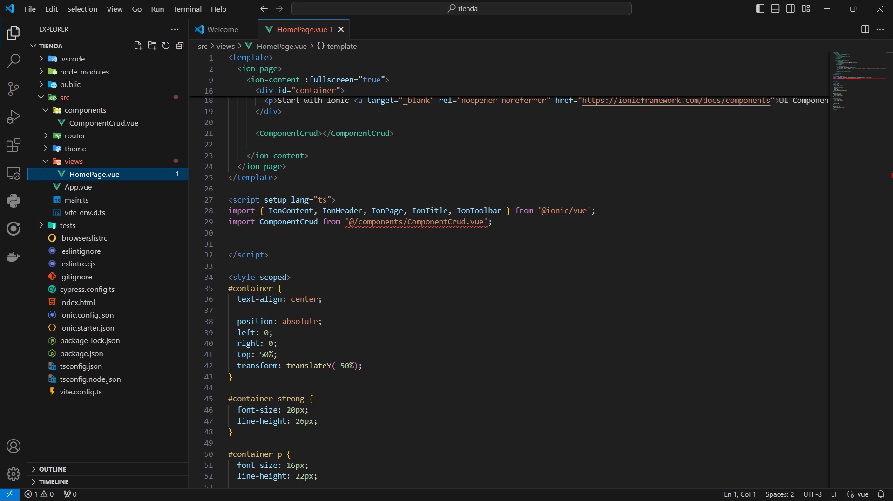
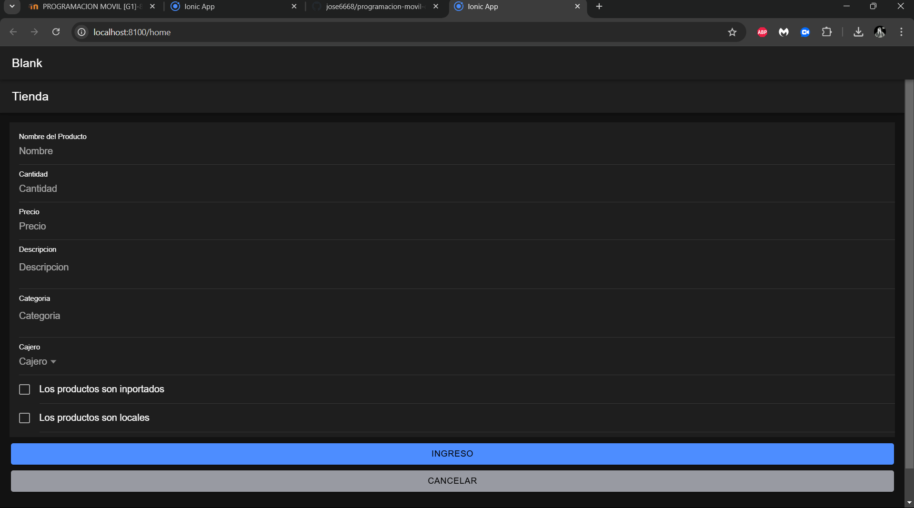

# programacion-movil-c3-q2

En este Ejemplo se realiza un formulario de una tienda y se desarrollado con Vue.js e Ionic.

## Contenido
- programacion-movil-c3-q2
- Ejemplo de Formulario para una tienda
  - Requisitos Previos
  - Ejecución del Proyecto
  - Ejemplo del Código

## Requisitos Previos
  
Antes de comenzar, asegúrate de tener instalados los siguientes programas:

- Node.js: v12 o superior
- Ionic : instalar con el comando `npm install -g @ionic/cli`

## Ejecución del Proyecto

Para ejecutar el proyecto en un servidor local de desarrollo, utiliza:

```bash
ionic serve
```

## Ejemplo de Código









[video paso a paso]()